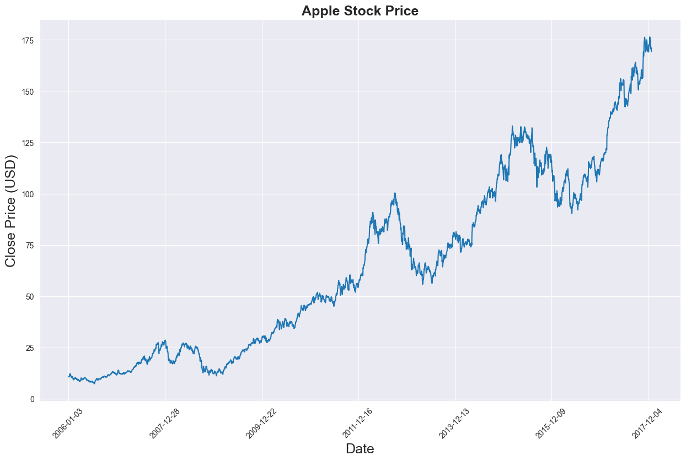
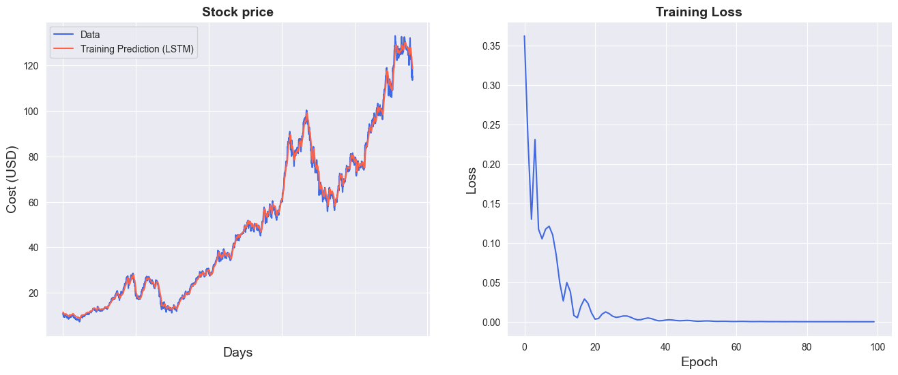
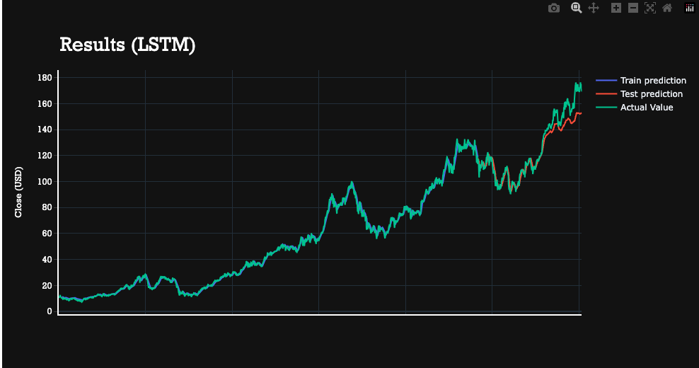
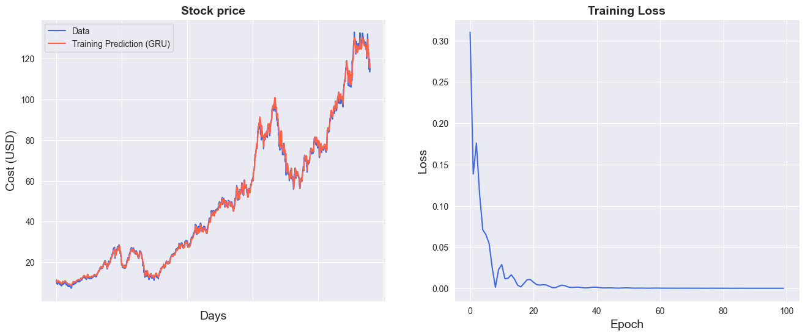
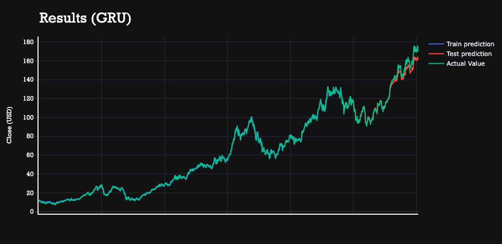

## LSTM and GRU

### Time Series
Machine Learning's captivating domain of time series forecasting commands attention, offering potentially significant benefits when integrated with advanced subjects like stock price prediction. Essentially, time series forecasting employs a specific model to anticipate future data points by utilizing the patterns found in previously observed value.

A time series, by definition, is a sequence of data points arranged in chronological order. This kind of problem holds significant relevance because numerous prediction challenges incorporate a temporal aspect. Uncovering the relationship between data and time is crucial to these analyses, such as weather forecasting or earthquake prediction. However, these issues are occasionally overlooked due to the non-trivial complexities involved in modeling these temporal relationships.

Stock market prediction entails efforts to estimate the future value of a company's stock. The accurate prognostication of a stock's future price can result in substantial gains, fitting this scenario into the realm of time series problems.

Over time, numerous methods have been developed to predict stock prices accurately, given their volatile and complex fluctuations. Neural networks, particularly Recurrent Neural Networks (RNNs), have exhibited significant applicability in this field. In this context, we will construct two distinct RNN models — Long Short-Term Memory (LSTM) and Gated Recurrent Units (GRU) — using PyTorch. We aim to forecast Apples's stock market price and compare these models' performance in aspects of time and efficiency.

### Recurrent Neural Network (RNN)

A Recurrent Neural Network (RNN) is a particular breed of artificial neural network crafted to discern patterns in sequential data to anticipate ensuing events. The power of this architecture lies in its interconnected nodes, enabling it to demonstrate dynamic behavior over time. Another notable attribute of this structure is the utilization of feedback loops for sequence processing. This feature facilitates the persistence of information, often likened to memory, rendering RNNs ideal for Natural Language Processing (NLP) and time series problems. This foundational structure gave rise to advanced architectures such as Long Short-Term Memory (LSTM) and Gated Recurrent Units (GRU).

An LSTM unit comprises a cell and three gates: an input gate, an output gate, and a forget gate. The cell retains values over arbitrary time intervals, while the trio of gates control the influx and efflux of information from the cell.


Conversely, a GRU possesses fewer parameters compared to an LSTM as it lacks an output gate. However, both configurations are capable of resolving the "short-term memory" problem typically associated with basic RNNs, and successfully maintain long-term correlations in sequential data.


While LSTM enjoys greater popularity at present, it's anticipated that GRU will ultimately surpass it due to its enhanced speed while maintaining comparable accuracy and effectiveness. It's likely that we'll observe a similar outcome in this case, with the GRU model demonstrating superior performance under these conditions.


```python
import numpy as np # linear algebra
import pandas as pd # data processing, CSV file I/O (e.g. pd.read_csv)

# Input data files are available in the read-only "../input/" directory
# For example, running this (by clicking run or pressing Shift+Enter) will list all files under the input directory

import os
for dirname, _, filenames in os.walk('./archive'):
    for filename in filenames:
        print(os.path.join(dirname, filename))

```

    ./archive/JPM_2006-01-01_to_2018-01-01.csv
    ./archive/MSFT_2006-01-01_to_2018-01-01.csv
    ./archive/JNJ_2006-01-01_to_2018-01-01.csv
    ./archive/UNH_2006-01-01_to_2018-01-01.csv
    ./archive/CAT_2006-01-01_to_2018-01-01.csv
    ./archive/AABA_2006-01-01_to_2018-01-01.csv
    ./archive/HD_2006-01-01_to_2018-01-01.csv
    ./archive/CVX_2006-01-01_to_2018-01-01.csv
    ./archive/MMM_2006-01-01_to_2018-01-01.csv
    ./archive/AMZN_2006-01-01_to_2018-01-01.csv
    ./archive/CSCO_2006-01-01_to_2018-01-01.csv
    ./archive/XOM_2006-01-01_to_2018-01-01.csv
    ./archive/all_stocks_2017-01-01_to_2018-01-01.csv
    ./archive/VZ_2006-01-01_to_2018-01-01.csv
    ./archive/WMT_2006-01-01_to_2018-01-01.csv
    ./archive/GS_2006-01-01_to_2018-01-01.csv
    ./archive/AAPL_2006-01-01_to_2018-01-01.csv
    ./archive/AXP_2006-01-01_to_2018-01-01.csv
    ./archive/all_stocks_2006-01-01_to_2018-01-01.csv
    ./archive/GOOGL_2006-01-01_to_2018-01-01.csv
    ./archive/UTX_2006-01-01_to_2018-01-01.csv
    ./archive/KO_2006-01-01_to_2018-01-01.csv
    ./archive/MRK_2006-01-01_to_2018-01-01.csv
    ./archive/TRV_2006-01-01_to_2018-01-01.csv
    ./archive/IBM_2006-01-01_to_2018-01-01.csv
    ./archive/INTC_2006-01-01_to_2018-01-01.csv
    ./archive/PFE_2006-01-01_to_2018-01-01.csv
    ./archive/GE_2006-01-01_to_2018-01-01.csv
    ./archive/DIS_2006-01-01_to_2018-01-01.csv
    ./archive/PG_2006-01-01_to_2018-01-01.csv
    ./archive/BA_2006-01-01_to_2018-01-01.csv
    ./archive/MCD_2006-01-01_to_2018-01-01.csv
    ./archive/NKE_2006-01-01_to_2018-01-01.csv


### Implementation

The dataset contains historical stock prices. We are going to predict the Close price of the stock, and the following is the data behavior over the years.


```python
filepath = './archive/AAPL_2006-01-01_to_2018-01-01.csv'
data = pd.read_csv(filepath)
data = data.sort_values('Date')
data.head()
```


<div>
<style scoped>
    .dataframe tbody tr th:only-of-type {
        vertical-align: middle;
    }

    .dataframe tbody tr th {
        vertical-align: top;
    }

    .dataframe thead th {
        text-align: right;
    }
</style>
<table border="1" class="dataframe">
  <thead>
    <tr style="text-align: right;">
      <th></th>
      <th>Date</th>
      <th>Open</th>
      <th>High</th>
      <th>Low</th>
      <th>Close</th>
      <th>Volume</th>
      <th>Name</th>
    </tr>
  </thead>
  <tbody>
    <tr>
      <th>0</th>
      <td>2006-01-03</td>
      <td>10.34</td>
      <td>10.68</td>
      <td>10.32</td>
      <td>10.68</td>
      <td>201853036</td>
      <td>AAPL</td>
    </tr>
    <tr>
      <th>1</th>
      <td>2006-01-04</td>
      <td>10.73</td>
      <td>10.85</td>
      <td>10.64</td>
      <td>10.71</td>
      <td>155225609</td>
      <td>AAPL</td>
    </tr>
    <tr>
      <th>2</th>
      <td>2006-01-05</td>
      <td>10.69</td>
      <td>10.70</td>
      <td>10.54</td>
      <td>10.63</td>
      <td>112396081</td>
      <td>AAPL</td>
    </tr>
    <tr>
      <th>3</th>
      <td>2006-01-06</td>
      <td>10.75</td>
      <td>10.96</td>
      <td>10.65</td>
      <td>10.90</td>
      <td>176139334</td>
      <td>AAPL</td>
    </tr>
    <tr>
      <th>4</th>
      <td>2006-01-09</td>
      <td>10.96</td>
      <td>11.03</td>
      <td>10.82</td>
      <td>10.86</td>
      <td>168861224</td>
      <td>AAPL</td>
    </tr>
  </tbody>
</table>
</div>





```python
import matplotlib.pyplot as plt
import seaborn as sns

sns.set_style("darkgrid")
plt.figure(figsize = (15,9))
plt.plot(data[['Close']])
plt.xticks(range(0,data.shape[0],500),data['Date'].loc[::500],rotation=45)
plt.title("Apple Stock Price",fontsize=18, fontweight='bold')
plt.xlabel('Date',fontsize=18)
plt.ylabel('Close Price (USD)',fontsize=18)
plt.show()
```


    


```python
price = data[['Close']]
price.info()
```

    <class 'pandas.core.frame.DataFrame'>
    Int64Index: 3019 entries, 0 to 3018
    Data columns (total 1 columns):
     #   Column  Non-Null Count  Dtype  
    ---  ------  --------------  -----  
     0   Close   3019 non-null   float64
    dtypes: float64(1)
    memory usage: 47.2 KB


I slice the data frame to get the column we want and normalize the data.


```python
from sklearn.preprocessing import MinMaxScaler

scaler = MinMaxScaler(feature_range=(-1, 1))
price['Close'] = scaler.fit_transform(price['Close'].values.reshape(-1,1))
```

    /var/folders/8_/k8h_gshs3_qdkr8glv1ff08h0000gn/T/ipykernel_43516/68737012.py:4: SettingWithCopyWarning: 
    A value is trying to be set on a copy of a slice from a DataFrame.
    Try using .loc[row_indexer,col_indexer] = value instead
    
    See the caveats in the documentation: https://pandas.pydata.org/pandas-docs/stable/user_guide/indexing.html#returning-a-view-versus-a-copy
      price['Close'] = scaler.fit_transform(price['Close'].values.reshape(-1,1))


We're now ready to partition the data into training and test sets. But prior to that, it's necessary to determine the width of the analysis window. This technique of employing previous time steps to forecast the subsequent time step is referred to as the sliding window approach.


```python
def split_data(stock, lookback):
    data_raw = stock.to_numpy() # convert to numpy array
    data = []
    
    # create all possible sequences of length seq_len
    for index in range(len(data_raw) - lookback): 
        data.append(data_raw[index: index + lookback])
    
    data = np.array(data);
    test_set_size = int(np.round(0.2*data.shape[0]));
    train_set_size = data.shape[0] - (test_set_size);
    
    x_train = data[:train_set_size,:-1,:]
    y_train = data[:train_set_size,-1,:]
    
    x_test = data[train_set_size:,:-1]
    y_test = data[train_set_size:,-1,:]
    
    return [x_train, y_train, x_test, y_test]
```


```python
lookback = 20 # choose sequence length
x_train, y_train, x_test, y_test = split_data(price, lookback)
print('x_train.shape = ',x_train.shape)
print('y_train.shape = ',y_train.shape)
print('x_test.shape = ',x_test.shape)
print('y_test.shape = ',y_test.shape)
```

    x_train.shape =  (2399, 19, 1)
    y_train.shape =  (2399, 1)
    x_test.shape =  (600, 19, 1)
    y_test.shape =  (600, 1)


Next, we convert them into tensors, the foundational data structure required for constructing a model in PyTorch.


```python
import torch
import torch.nn as nn

x_train = torch.from_numpy(x_train).type(torch.Tensor)
x_test = torch.from_numpy(x_test).type(torch.Tensor)
y_train_lstm = torch.from_numpy(y_train).type(torch.Tensor)
y_test_lstm = torch.from_numpy(y_test).type(torch.Tensor)
y_train_gru = torch.from_numpy(y_train).type(torch.Tensor)
y_test_gru = torch.from_numpy(y_test).type(torch.Tensor)
```


```python
input_dim = 1
hidden_dim = 32
num_layers = 2
output_dim = 1
num_epochs = 100
```

### LSTM


```python
class LSTM(nn.Module):
    def __init__(self, input_dim, hidden_dim, num_layers, output_dim):
        super(LSTM, self).__init__()
        self.hidden_dim = hidden_dim
        self.num_layers = num_layers
        
        self.lstm = nn.LSTM(input_dim, hidden_dim, num_layers, batch_first=True)
        self.fc = nn.Linear(hidden_dim, output_dim)

    def forward(self, x):
        h0 = torch.zeros(self.num_layers, x.size(0), self.hidden_dim).requires_grad_()
        c0 = torch.zeros(self.num_layers, x.size(0), self.hidden_dim).requires_grad_()
        out, (hn, cn) = self.lstm(x, (h0.detach(), c0.detach()))
        out = self.fc(out[:, -1, :]) 
        return out
```


```python
model = LSTM(input_dim=input_dim, hidden_dim=hidden_dim, output_dim=output_dim, num_layers=num_layers)
criterion = torch.nn.MSELoss(reduction='mean')
optimiser = torch.optim.Adam(model.parameters(), lr=0.01)
```


```python
import time

hist = np.zeros(num_epochs)
start_time = time.time()
lstm = []

for t in range(num_epochs):
    y_train_pred = model(x_train)

    loss = criterion(y_train_pred, y_train_lstm)
    print("Epoch ", t, "MSE: ", loss.item())
    hist[t] = loss.item()

    optimiser.zero_grad()
    loss.backward()
    optimiser.step()
    
training_time = time.time()-start_time
print("Training time: {}".format(training_time))
```

    Epoch  0 MSE:  0.25819653272628784
    Epoch  1 MSE:  0.15166231989860535
    Epoch  2 MSE:  0.20903076231479645
    Epoch  3 MSE:  0.13991586863994598
    Epoch  4 MSE:  0.1287676990032196
    Epoch  5 MSE:  0.13563665747642517
    Epoch  6 MSE:  0.13573406636714935
    Epoch  7 MSE:  0.12434989213943481
    Epoch  8 MSE:  0.1031389907002449
    Epoch  9 MSE:  0.0779111385345459
    Epoch  10 MSE:  0.06311900913715363
    Epoch  11 MSE:  0.07091287523508072
    Epoch  12 MSE:  0.052488457411527634
    Epoch  13 MSE:  0.023740172386169434
    Epoch  14 MSE:  0.01886197179555893
    Epoch  15 MSE:  0.023339685052633286
    Epoch  16 MSE:  0.017914501950144768
    Epoch  17 MSE:  0.010528038255870342
    Epoch  18 MSE:  0.020709635689854622
    Epoch  19 MSE:  0.022142166271805763
    Epoch  20 MSE:  0.00913378968834877
    Epoch  21 MSE:  0.0032837125472724438
    Epoch  22 MSE:  0.006005624774843454
    Epoch  23 MSE:  0.009221922606229782
    Epoch  24 MSE:  0.009343614801764488
    Epoch  25 MSE:  0.007402882911264896
    Epoch  26 MSE:  0.006014988292008638
    Epoch  27 MSE:  0.006637887097895145
    Epoch  28 MSE:  0.007978024892508984
    Epoch  29 MSE:  0.007520338520407677
    Epoch  30 MSE:  0.005026531405746937
    Epoch  31 MSE:  0.002815255429595709
    Epoch  32 MSE:  0.002627915469929576
    Epoch  33 MSE:  0.0038487249985337257
    Epoch  34 MSE:  0.004618681501597166
    Epoch  35 MSE:  0.0039092665538191795
    Epoch  36 MSE:  0.002484086435288191
    Epoch  37 MSE:  0.0018542427569627762
    Epoch  38 MSE:  0.002269477816298604
    Epoch  39 MSE:  0.002432651352137327
    Epoch  40 MSE:  0.0017461515963077545
    Epoch  41 MSE:  0.001250344910658896
    Epoch  42 MSE:  0.0016412724507972598
    Epoch  43 MSE:  0.0022176974453032017
    Epoch  44 MSE:  0.002139537362381816
    Epoch  45 MSE:  0.0015903041930869222
    Epoch  46 MSE:  0.0013555067125707865
    Epoch  47 MSE:  0.0015729618025943637
    Epoch  48 MSE:  0.0015560296596959233
    Epoch  49 MSE:  0.0010814378038048744
    Epoch  50 MSE:  0.0007583849364891648
    Epoch  51 MSE:  0.0008783523226156831
    Epoch  52 MSE:  0.0010345984483137727
    Epoch  53 MSE:  0.0009140677284449339
    Epoch  54 MSE:  0.0007315980619750917
    Epoch  55 MSE:  0.0007604123093187809
    Epoch  56 MSE:  0.0008461487013846636
    Epoch  57 MSE:  0.0007311741355806589
    Epoch  58 MSE:  0.0005497800884768367
    Epoch  59 MSE:  0.0005577158881351352
    Epoch  60 MSE:  0.0006879133288748562
    Epoch  61 MSE:  0.0007144041010178626
    Epoch  62 MSE:  0.0006207934347912669
    Epoch  63 MSE:  0.0005688412929885089
    Epoch  64 MSE:  0.0005930980551056564
    Epoch  65 MSE:  0.0005647227517329156
    Epoch  66 MSE:  0.00047004505177028477
    Epoch  67 MSE:  0.0004422623314894736
    Epoch  68 MSE:  0.0004969367873854935
    Epoch  69 MSE:  0.0005126534379087389
    Epoch  70 MSE:  0.00046223439858295023
    Epoch  71 MSE:  0.00043931364780291915
    Epoch  72 MSE:  0.0004609820316545665
    Epoch  73 MSE:  0.00045188714284449816
    Epoch  74 MSE:  0.0004201307019684464
    Epoch  75 MSE:  0.00043058270239271224
    Epoch  76 MSE:  0.0004576134087983519
    Epoch  77 MSE:  0.0004446248640306294
    Epoch  78 MSE:  0.0004175296053290367
    Epoch  79 MSE:  0.00041787829832173884
    Epoch  80 MSE:  0.00041931969462893903
    Epoch  81 MSE:  0.0004008542455267161
    Epoch  82 MSE:  0.0003951751277782023
    Epoch  83 MSE:  0.0004096981429029256
    Epoch  84 MSE:  0.00041126698488369584
    Epoch  85 MSE:  0.0003979630710091442
    Epoch  86 MSE:  0.0003955823485739529
    Epoch  87 MSE:  0.0004000987682957202
    Epoch  88 MSE:  0.0003947264631278813
    Epoch  89 MSE:  0.00039027887396514416
    Epoch  90 MSE:  0.00039583834586665034
    Epoch  91 MSE:  0.00039670622209087014
    Epoch  92 MSE:  0.0003883809840772301
    Epoch  93 MSE:  0.00038467306876555085
    Epoch  94 MSE:  0.00038626548484899104
    Epoch  95 MSE:  0.00038355711149051785
    Epoch  96 MSE:  0.0003808493784163147
    Epoch  97 MSE:  0.00038343065534718335
    Epoch  98 MSE:  0.0003837483818642795
    Epoch  99 MSE:  0.00037956441519781947
    Training time: 8.352406024932861


```python
predict = pd.DataFrame(scaler.inverse_transform(y_train_pred.detach().numpy()))
original = pd.DataFrame(scaler.inverse_transform(y_train_lstm.detach().numpy()))
```


```python
import seaborn as sns
sns.set_style("darkgrid")    

fig = plt.figure()
fig.subplots_adjust(hspace=0.2, wspace=0.2)

plt.subplot(1, 2, 1)
ax = sns.lineplot(x = original.index, y = original[0], label="Data", color='royalblue')
ax = sns.lineplot(x = predict.index, y = predict[0], label="Training Prediction (LSTM)", color='tomato')
ax.set_title('Stock price', size = 14, fontweight='bold')
ax.set_xlabel("Days", size = 14)
ax.set_ylabel("Cost (USD)", size = 14)
ax.set_xticklabels('', size=10)


plt.subplot(1, 2, 2)
ax = sns.lineplot(data=hist, color='royalblue')
ax.set_xlabel("Epoch", size = 14)
ax.set_ylabel("Loss", size = 14)
ax.set_title("Training Loss", size = 14, fontweight='bold')
fig.set_figheight(6)
fig.set_figwidth(16)
```


    

    


```python
import math, time
from sklearn.metrics import mean_squared_error

# make predictions
y_test_pred = model(x_test)

# invert predictions
y_train_pred = scaler.inverse_transform(y_train_pred.detach().numpy())
y_train = scaler.inverse_transform(y_train_lstm.detach().numpy())
y_test_pred = scaler.inverse_transform(y_test_pred.detach().numpy())
y_test = scaler.inverse_transform(y_test_lstm.detach().numpy())

# calculate root mean squared error
trainScore = math.sqrt(mean_squared_error(y_train[:,0], y_train_pred[:,0]))
print('Train Score: %.2f RMSE' % (trainScore))
testScore = math.sqrt(mean_squared_error(y_test[:,0], y_test_pred[:,0]))
print('Test Score: %.2f RMSE' % (testScore))
lstm.append(trainScore)
lstm.append(testScore)
lstm.append(training_time)
```

    Train Score: 1.65 RMSE
    Test Score: 5.56 RMSE


```python
# shift train predictions for plotting
trainPredictPlot = np.empty_like(price)
trainPredictPlot[:, :] = np.nan
trainPredictPlot[lookback:len(y_train_pred)+lookback, :] = y_train_pred

# shift test predictions for plotting
testPredictPlot = np.empty_like(price)
testPredictPlot[:, :] = np.nan
testPredictPlot[len(y_train_pred)+lookback-1:len(price)-1, :] = y_test_pred

original = scaler.inverse_transform(price['Close'].values.reshape(-1,1))

predictions = np.append(trainPredictPlot, testPredictPlot, axis=1)
predictions = np.append(predictions, original, axis=1)
result = pd.DataFrame(predictions)
```


```python
import plotly.express as px
import plotly.graph_objects as go

fig = go.Figure()
fig.add_trace(go.Scatter(go.Scatter(x=result.index, y=result[0],
                    mode='lines',
                    name='Train prediction')))
fig.add_trace(go.Scatter(x=result.index, y=result[1],
                    mode='lines',
                    name='Test prediction'))
fig.add_trace(go.Scatter(go.Scatter(x=result.index, y=result[2],
                    mode='lines',
                    name='Actual Value')))
fig.update_layout(
    xaxis=dict(
        showline=True,
        showgrid=True,
        showticklabels=False,
        linecolor='white',
        linewidth=2
    ),
    yaxis=dict(
        title_text='Close (USD)',
        titlefont=dict(
            family='Rockwell',
            size=12,
            color='white',
        ),
        showline=True,
        showgrid=True,
        showticklabels=True,
        linecolor='white',
        linewidth=2,
        ticks='outside',
        tickfont=dict(
            family='Rockwell',
            size=12,
            color='white',
        ),
    ),
    showlegend=True,
    template = 'plotly_dark'

)


annotations = []
annotations.append(dict(xref='paper', yref='paper', x=0.0, y=1.05,
                              xanchor='left', yanchor='bottom',
                              text='Results (LSTM)',
                              font=dict(family='Rockwell',
                                        size=26,
                                        color='white'),
                              showarrow=False))
fig.update_layout(annotations=annotations)

fig.show()
```



The model behaves well with the training set, and it also has solid performace with the test set. The model is probably overfitting, especially taking into consideration that the loss is minimal after the 40th epoch.

### GRU


```python
class GRU(nn.Module):
    def __init__(self, input_dim, hidden_dim, num_layers, output_dim):
        super(GRU, self).__init__()
        self.hidden_dim = hidden_dim
        self.num_layers = num_layers
        
        self.gru = nn.GRU(input_dim, hidden_dim, num_layers, batch_first=True)
        self.fc = nn.Linear(hidden_dim, output_dim)

    def forward(self, x):
        h0 = torch.zeros(self.num_layers, x.size(0), self.hidden_dim).requires_grad_()
        out, (hn) = self.gru(x, (h0.detach()))
        out = self.fc(out[:, -1, :]) 
        return out
```


```python
model = GRU(input_dim=input_dim, hidden_dim=hidden_dim, output_dim=output_dim, num_layers=num_layers)
criterion = torch.nn.MSELoss(reduction='mean')
optimiser = torch.optim.Adam(model.parameters(), lr=0.01)
```


```python
hist = np.zeros(num_epochs)
start_time = time.time()
gru = []

for t in range(num_epochs):
    y_train_pred = model(x_train)

    loss = criterion(y_train_pred, y_train_gru)
    print("Epoch ", t, "MSE: ", loss.item())
    hist[t] = loss.item()

    optimiser.zero_grad()
    loss.backward()
    optimiser.step()

training_time = time.time()-start_time    
print("Training time: {}".format(training_time))
```

    Epoch  0 MSE:  0.3607046902179718
    Epoch  1 MSE:  0.13102510571479797
    Epoch  2 MSE:  0.19682788848876953
    Epoch  3 MSE:  0.12917079031467438
    Epoch  4 MSE:  0.075187087059021
    Epoch  5 MSE:  0.07155207544565201
    Epoch  6 MSE:  0.06979498267173767
    Epoch  7 MSE:  0.045164529234170914
    Epoch  8 MSE:  0.010227248072624207
    Epoch  9 MSE:  0.007098929025232792
    Epoch  10 MSE:  0.03696290776133537
    Epoch  11 MSE:  0.023822534829378128
    Epoch  12 MSE:  0.007158784195780754
    Epoch  13 MSE:  0.011737179011106491
    Epoch  14 MSE:  0.018340380862355232
    Epoch  15 MSE:  0.01571972481906414
    Epoch  16 MSE:  0.007737305015325546
    Epoch  17 MSE:  0.0022043471690267324
    Epoch  18 MSE:  0.003535511204972863
    Epoch  19 MSE:  0.009062006138265133
    Epoch  20 MSE:  0.011892840266227722
    Epoch  21 MSE:  0.009278996847569942
    Epoch  22 MSE:  0.004890399053692818
    Epoch  23 MSE:  0.00290724472142756
    Epoch  24 MSE:  0.0037367662880569696
    Epoch  25 MSE:  0.005075107794255018
    Epoch  26 MSE:  0.0048552630469202995
    Epoch  27 MSE:  0.0029767893720418215
    Epoch  28 MSE:  0.0011302019702270627
    Epoch  29 MSE:  0.0010998218785971403
    Epoch  30 MSE:  0.0027486730832606554
    Epoch  31 MSE:  0.003973710350692272
    Epoch  32 MSE:  0.0033208823297172785
    Epoch  33 MSE:  0.001725937006995082
    Epoch  34 MSE:  0.0009095442364923656
    Epoch  35 MSE:  0.0012437441619113088
    Epoch  36 MSE:  0.001808099914342165
    Epoch  37 MSE:  0.001749989576637745
    Epoch  38 MSE:  0.0011168664786964655
    Epoch  39 MSE:  0.0006078396691009402
    Epoch  40 MSE:  0.0007392823463305831
    Epoch  41 MSE:  0.0012739860685542226
    Epoch  42 MSE:  0.001527499407529831
    Epoch  43 MSE:  0.0012058777501806617
    Epoch  44 MSE:  0.0006985657382756472
    Epoch  45 MSE:  0.0005090595805086195
    Epoch  46 MSE:  0.0006709578447043896
    Epoch  47 MSE:  0.0008276336011476815
    Epoch  48 MSE:  0.0007188778254203498
    Epoch  49 MSE:  0.00046144291991367936
    Epoch  50 MSE:  0.00036167059442959726
    Epoch  51 MSE:  0.0005161706358194351
    Epoch  52 MSE:  0.0006932021933607757
    Epoch  53 MSE:  0.0006540967733599246
    Epoch  54 MSE:  0.00046293693594634533
    Epoch  55 MSE:  0.0003537530137691647
    Epoch  56 MSE:  0.0004015856538899243
    Epoch  57 MSE:  0.0004694756935350597
    Epoch  58 MSE:  0.0004315198748372495
    Epoch  59 MSE:  0.00033121410524472594
    Epoch  60 MSE:  0.0002968600601889193
    Epoch  61 MSE:  0.00035973641206510365
    Epoch  62 MSE:  0.00042053856304846704
    Epoch  63 MSE:  0.00039580956217832863
    Epoch  64 MSE:  0.00032569453469477594
    Epoch  65 MSE:  0.000298373750410974
    Epoch  66 MSE:  0.0003244410618208349
    Epoch  67 MSE:  0.00034042992047034204
    Epoch  68 MSE:  0.00031064936774782836
    Epoch  69 MSE:  0.0002729821135289967
    Epoch  70 MSE:  0.00027573812985792756
    Epoch  71 MSE:  0.0003066273347940296
    Epoch  72 MSE:  0.0003163278743159026
    Epoch  73 MSE:  0.0002932495262939483
    Epoch  74 MSE:  0.00027294218307361007
    Epoch  75 MSE:  0.0002778717316687107
    Epoch  76 MSE:  0.0002882281842175871
    Epoch  77 MSE:  0.0002800409565679729
    Epoch  78 MSE:  0.0002621126768644899
    Epoch  79 MSE:  0.0002582546148914844
    Epoch  80 MSE:  0.000269515992840752
    Epoch  81 MSE:  0.0002754448796622455
    Epoch  82 MSE:  0.0002673306444194168
    Epoch  83 MSE:  0.0002585184993222356
    Epoch  84 MSE:  0.0002598936844151467
    Epoch  85 MSE:  0.0002639705198816955
    Epoch  86 MSE:  0.00026010669535025954
    Epoch  87 MSE:  0.0002519670524634421
    Epoch  88 MSE:  0.0002499922120478004
    Epoch  89 MSE:  0.0002542092406656593
    Epoch  90 MSE:  0.0002556447288952768
    Epoch  91 MSE:  0.0002515747328288853
    Epoch  92 MSE:  0.0002483536081854254
    Epoch  93 MSE:  0.0002494044601917267
    Epoch  94 MSE:  0.0002502511197235435
    Epoch  95 MSE:  0.00024729460710659623
    Epoch  96 MSE:  0.00024373934138566256
    Epoch  97 MSE:  0.00024349824525415897
    Epoch  98 MSE:  0.000244816328631714
    Epoch  99 MSE:  0.0002440418174955994
    Training time: 8.153863906860352


```python
predict = pd.DataFrame(scaler.inverse_transform(y_train_pred.detach().numpy()))
original = pd.DataFrame(scaler.inverse_transform(y_train_gru.detach().numpy()))
```


```python
import seaborn as sns
sns.set_style("darkgrid")    

fig = plt.figure()
fig.subplots_adjust(hspace=0.2, wspace=0.2)

plt.subplot(1, 2, 1)
ax = sns.lineplot(x = original.index, y = original[0], label="Data", color='royalblue')
ax = sns.lineplot(x = predict.index, y = predict[0], label="Training Prediction (GRU)", color='tomato')
ax.set_title('Stock price', size = 14, fontweight='bold')
ax.set_xlabel("Days", size = 14)
ax.set_ylabel("Cost (USD)", size = 14)
ax.set_xticklabels('', size=10)


plt.subplot(1, 2, 2)
ax = sns.lineplot(data=hist, color='royalblue')
ax.set_xlabel("Epoch", size = 14)
ax.set_ylabel("Loss", size = 14)
ax.set_title("Training Loss", size = 14, fontweight='bold')
fig.set_figheight(6)
fig.set_figwidth(16)
```




```python
import math, time
from sklearn.metrics import mean_squared_error

# make predictions
y_test_pred = model(x_test)

# invert predictions
y_train_pred = scaler.inverse_transform(y_train_pred.detach().numpy())
y_train = scaler.inverse_transform(y_train_gru.detach().numpy())
y_test_pred = scaler.inverse_transform(y_test_pred.detach().numpy())
y_test = scaler.inverse_transform(y_test_gru.detach().numpy())

# calculate root mean squared error
trainScore = math.sqrt(mean_squared_error(y_train[:,0], y_train_pred[:,0]))
print('Train Score: %.2f RMSE' % (trainScore))
testScore = math.sqrt(mean_squared_error(y_test[:,0], y_test_pred[:,0]))
print('Test Score: %.2f RMSE' % (testScore))
gru.append(trainScore)
gru.append(testScore)
gru.append(training_time)
```

    Train Score: 1.32 RMSE
    Test Score: 4.90 RMSE


```python
# shift train predictions for plotting
trainPredictPlot = np.empty_like(price)
trainPredictPlot[:, :] = np.nan
trainPredictPlot[lookback:len(y_train_pred)+lookback, :] = y_train_pred

# shift test predictions for plotting
testPredictPlot = np.empty_like(price)
testPredictPlot[:, :] = np.nan
testPredictPlot[len(y_train_pred)+lookback-1:len(price)-1, :] = y_test_pred

original = scaler.inverse_transform(price['Close'].values.reshape(-1,1))

predictions = np.append(trainPredictPlot, testPredictPlot, axis=1)
predictions = np.append(predictions, original, axis=1)
result = pd.DataFrame(predictions)
```


```python
import plotly.express as px
import plotly.graph_objects as go

fig = go.Figure()
fig.add_trace(go.Scatter(go.Scatter(x=result.index, y=result[0],
                    mode='lines',
                    name='Train prediction')))
fig.add_trace(go.Scatter(x=result.index, y=result[1],
                    mode='lines',
                    name='Test prediction'))
fig.add_trace(go.Scatter(go.Scatter(x=result.index, y=result[2],
                    mode='lines',
                    name='Actual Value')))
fig.update_layout(
    xaxis=dict(
        showline=True,
        showgrid=True,
        showticklabels=False,
        linecolor='white',
        linewidth=2
    ),
    yaxis=dict(
        title_text='Close (USD)',
        titlefont=dict(
            family='Rockwell',
            size=12,
            color='white',
        ),
        showline=True,
        showgrid=True,
        showticklabels=True,
        linecolor='white',
        linewidth=2,
        ticks='outside',
        tickfont=dict(
            family='Rockwell',
            size=12,
            color='white',
        ),
    ),
    showlegend=True,
    template = 'plotly_dark'

)


annotations = []
annotations.append(dict(xref='paper', yref='paper', x=0.0, y=1.05,
                              xanchor='left', yanchor='bottom',
                              text='Results (GRU)',
                              font=dict(family='Rockwell',
                                        size=26,
                                        color='white'),
                              showarrow=False))
fig.update_layout(annotations=annotations)

fig.show()
```


```python
lstm = pd.DataFrame(lstm, columns=['LSTM'])
gru = pd.DataFrame(gru, columns=['GRU'])
result = pd.concat([lstm, gru], axis=1, join='inner')
result.index = ['Train RMSE', 'Test RMSE', 'Train Time']
result
```


<div>
<style scoped>
    .dataframe tbody tr th:only-of-type {
        vertical-align: middle;
    }

    .dataframe tbody tr th {
        vertical-align: top;
    }

    .dataframe thead th {
        text-align: right;
    }
</style>
<table border="1" class="dataframe">
  <thead>
    <tr style="text-align: right;">
      <th></th>
      <th>LSTM</th>
      <th>GRU</th>
    </tr>
  </thead>
  <tbody>
    <tr>
      <th>Train RMSE</th>
      <td>1.648017</td>
      <td>1.321451</td>
    </tr>
    <tr>
      <th>Test RMSE</th>
      <td>5.562765</td>
      <td>4.904847</td>
    </tr>
    <tr>
      <th>Train Time</th>
      <td>8.352406</td>
      <td>8.153864</td>
    </tr>
  </tbody>
</table>
</div>




### Conclusion
Both models demonstrate commendable performance during the training phase, but their progress seems to plateau around the 40th epoch, indicating that the predefined 100 epochs may not be necessary.

In line with our expectations, the GRU neural network excelled over the LSTM in terms of accuracy, achieving a lower mean square error (in both training and, crucially, in the test set) and faster processing speed. 


